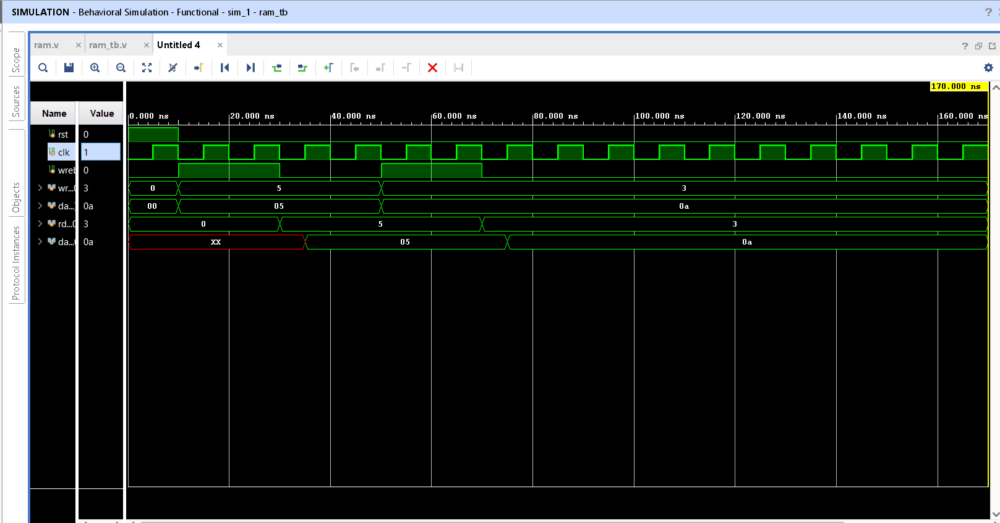

# projects_verilog
# 8x8 RAM using Verilog

My first Verilog HDL project.

Features:
- 8 memory locations
- 8-bit data width
- Synchronous read
- Synchronous write
- Asynchronous reset

Files:
- ram.v : RAM design
- ram_tb.v : Testbench
- testbench waveform.png : Simulation waveform

Tools Used:
- Vivado
- Verilog HDL
- ## Waveform

